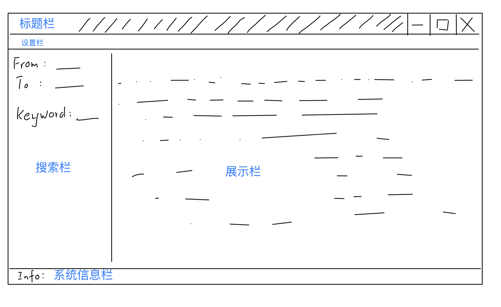
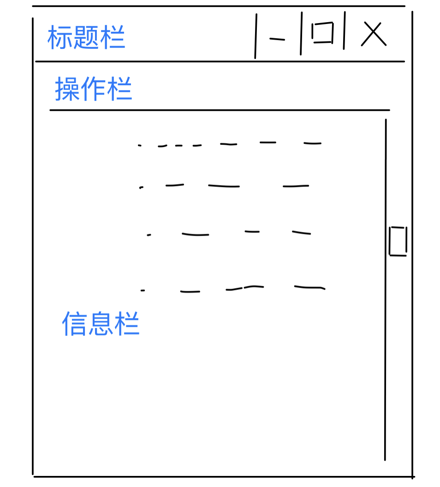

# 基本信息

开发平台：Windows10

开发语言：python

数据库实现：sqlite

# 界面设计

软件的主要界面有两个：主界面与文献信息界面，力求设计简介

## 主界面



标题栏：展示软件名

设置栏：放置基本操作按钮：添加文件、修改设置、退出

搜索栏：设置文献筛选信息

展示栏：展示文献列表，每个文献展示基本信息

## 文献信息界面



标题栏：展示文献名称

操作栏：放置基本操作按钮：删除、修改、保存

信息栏：展示文献详细信息

# 数据设计

本软件使用 sqlite 数据库保存文献信息，数据库文件命名为：`database.db`，保存在 .py 文件的同目录下。

同时，为了保存配置信息，软件需要一个`setting.conf`文件，保存pdf阅读器的目录

## sqlite 数据库内容设计

数据库只保存一张表，各字段如下：

| 属性中文名   | 属性名             | 类型      | 说明                        |                         |
| ------- | --------------- | ------- | ------------------------- | ----------------------- |
| 文献号     | No              | INTEGER | primary key AUTOINCREMENT | 自动填写，对用户透明（用户不可见）       |
| 阅读标记    | ReadOrNot       | INTEGER | 仅允许 0 1                   | 0表示未阅读完，1表示已经阅读完        |
| 发表日期    | PublicationYear | INTEGER | YYYY                      | 4位数字，表示年份，设置为INT类型以方便筛选 |
| 会议      | Publisher       | TEXT    |                           |                         |
| 文献名称    | PaperName       | TEXT    |                           |                         |
| 标签      | Tags            | TEXT    | 标签\$标签\$标签                | 使用\$分割标签，标签内容不允许使用\$    |
| 备注      | Notes           | TEXT    |                           |                         |
| 网页链接    | Url             | TEXT    |                           |                         |
| 本地链接    | Path            | TEXT    | 要求使用绝对路径                  |                         |
| 上一次阅读日期 | LastReadDate    | TEXT    | YYYYMMDD                  | 推荐使用年月日的格式，实际上不做要求      |
| 快读问题    | Q0-Q9           | TEXT    | 来自Readpaper的10个论文快读问题     |                         |
|         | Q1              | TEXT    |                           |                         |
|         | Q2              | TEXT    |                           |                         |
|         | Q3              | TEXT    |                           |                         |
|         | Q4              | TEXT    |                           |                         |
|         | Q5              | TEXT    |                           |                         |
|         | Q6              | TEXT    |                           |                         |
|         | Q7              | TEXT    |                           |                         |
|         | Q8              | TEXT    |                           |                         |
|         | Q9              | TEXT    |                           |                         |

## 配置文件数据

`setting.conf` 文件满足config文件的结构，使用`utf-8` 编码

```config
[default]
pdf_reader # pdf阅读器的绝对目录
```

# 程序设计

本软件使用 python 实现，使用 `sqlite3` 组件实现数据库管理，使用 `tkinter` 实现 ui 界面。

本软件主要实现了两个类：`DataBase` 与 `TkUI`：

- DataBase 用来代理与数据库的操作。
- TkUI 用来实现可交互用户界面，处理用户操作，通过调用 DataBase 实例获取文献信息、修改文献库。

## 文件目录

```
----------------
|- database.db        // 数据库文件
|- setting.conf        // 配置文件
|
|- globalvar.py        // 全局变量文件，存储返回的错误类型
|- database.py        // DataBase 的实现
|- tkui.py            // TkUI 的实现
|
|- main.py            // 主程序
```

## DataBase 类

这里只给出功能实现函数，部分辅助实现函数不在这里给出说明

DataBase 的实现位于 database.py

使用组件 `sqlite3, os, copy`

### database.py 全局变量

`DB_REL_PATH` ：数据库文件的相对目录

### DataBase 静态变量

`FIELD_LIST` ：字符串 list，保存文献信息的全部字段名

`SIMPLE_FIELD_LIST` ：字符串 list，保存显示文献条目时需要的信息，是`FIELD_LIST`的子集

### DataBase 函数

函数列表

```python
__init__(self)
add_paper(self, info:dict)
modi_paper(self, info:dict)
del_paper(self, info:dict)
show_paper(self, info:dict)
show_all_paper(self)
find_paper(self, info:dict)
get_all_pub(self)
get_all_tags(self)
```

#### \_\_init\_\_()

输入：

- 无输入

输出：

- None

主要功能：

- 构造函数

- 连接数据库文件（如没有数据库文件就生成数据库文件）

#### add\_paper()

输入：

- info：字典，以 FIELD_LIST 中的字段为 key；PaperName字段不能为空；不读取 No、 ReadOrNot 字段信息

输出：

- 成功添加返回 MY_SUCCESS

主要功能：

- 向文献库中添加文献
- No 字段自动生成
- ReadOrNot 字段默认为0

#### modi\_paper()

输入：

- info：字典，可能包含 FIELD_LIST 中的全部字段，No字段不能为空

输出：

- 成功修改返回 MY_SUCCESS

主要功能：

- 以 No 查找，使用 info 提供的信息修改对应文献的信息

#### del\_paper()

输入：

- info：字典，必须包含 No 字段

输出：

- 成功返回 MY_SUCCESS

主要功能：

- 从 info 中查找 No ，删除对应的文献条目
- 只能删除一条文献

#### show\_all\_paper()

输入：

- 无

输出：

- 成功则返回：字典 list，包含当前数据库中全部文献的全部信息。

#### find\_paper()

输入：

- info：字典，
  - key取值：pubyear_begin pubyear_end puber_list tag_list keyword keyword_flag
  - value对应取值：起始年份 终止年份 出版商列表 标签列表 关键词 关键词查询位置标志

输出：

- 文献信息字典列表

主要功能：

- 提供搜索功能
- 筛选 pubyear_begin 当年及之后的文献
- 筛选 pubyear_end 当年及之前的文献
- 筛选属于 puber_list 中的出版商的文献
- 筛选包含 tag_list 中任意标签的文献
- 由 keyword_flag 的不同，在文献名和文献备注中依据是否包含 keyword 筛选文献

#### get\_all\_pub()

输入：

- 无

输出：

- 包含数据库中全部出版商（不重复）的列表

主要功能：

- 返回数据库中全部的出版商的列表
- 为 TkUI的出版商选择列表提供信息

#### get\_all\_tags()

输入：

- 无

输出：

- 包含数据库中全部标签（不重复）的列表

主要功能：

- 返回数据库中全部的标签的列表
- 为 TkUI的标签选择列表提供信息

## TkUI 类

TkUI 主要用来生成可视化界面，接收用户的输入

TkUI 类的实现位于 tkui.py

主要使用组件`tkinter` 实现界面，还使用 DataBase 类实例作为私有变量，使用组件 `configparser, os, subprocess, copy`

### tkui.py 全部变量

`SETTING_PATH` 保存配置文件 `setting.conf` 的相对位置

### TkUI 主要私有变量

m_db : DataBase 实例，用来进行数据库操作

m_conf : configparser.ConfigParser 实例，用来进行配置文件操作

all_tag_list : 全部标签列表

all_puber_list : 全部出版商列表

paper_list : 当前用于展示的paper列表，是一个字典的列表，每个字典包含一个文献的全部信息

filter : 字典，当前筛选条件，键值内容与 DataBase.find_paper() 函数的输入要求一致

TkUI 使用 tkinter 实现UI，有大量UI部件及其存储值的变量，大多数都被设置成了私有变量，数量过多，这里不全部写出

root : tkinter.Tk 实例，主窗口

info_var : tkinter.StringVar 实例，低端信息栏的信息内容

### TkUI 函数

仅与 UI 操作相关的函数不在这里给出，详请参照源文件注释

由于使用类的私有函数，可以访问类实例的私有变量并修改私有变量内容，大部分的函数没有输入、输出，故部分函数没有给出输入/输出，而在主要功能中做相关说明

#### \_\_init\_\_(db:DataBase)

输入：

- db：DataBase 实例

输出：

- None

主要功能

- 生成主窗口，主要包含搜索栏与文献展示栏

#### table_renewer(self)

主要功能

- 调用 search()函数，使用 filter 的现有查询条件更新 paper_list
- 刷新 展示栏的显示
- 注：search 函数位于 tkui.py，不是TkUI的内部函数

#### search_renewer(self)

主要功能：

- 调用 `m_db`  的 `get_all_tag()` 与`get_all_pub()` 函数更新 all_tag_list 与 all_puber_list

#### search_paper(self)

主要功能：

- 从搜索栏中的信息更新筛选条件，调用 self.table_renewer() 更新文献

#### resume_paper(self)

主要功能：

- 重置筛选条件，重置搜索结果

#### get_setting(self)

主要功能：

- 读取设置文件，更新 m_conf

### tkui.py 中的其它函数（非TkUI类函数）

这一部分的函数也承担主要功能，但不属于TkUI类

#### search(ui:TkUI, info:dict={})

输入：

- ui ：TkUI 类实例
- info：字典，查询条件，键值设置与 DataBase.find_paper() 中的info输入要求一致

输出：

- 文献字典列表

主要功能：

- 与数据库连接，使用 ui.m_db.find_paper(info)  返回查询结果

#### open_add_ui(ui:TkUI)

输入：

- ui ：TkUI类实例

输出：

- 无

主要功能：

- 该函数用来响应主窗口设置栏的添加文献按钮，实现读入文献信息，向数据库中添加文献

#### open_edit_ui(event, ui:TkUI, paper_no:str)

输入：

- ui ：TkUI类实例
- paper_no : 文献的No，用于确认文献条目

输出：

- 无

主要功能：

- 该函数用于建立文献的详请界面
- 处理文献的修改、删除功能
- 处理文献的打开功能

#### open_setting_ui(ui:TkUI)

输入：

- ui ：TkUI类实例

输出：

- 无

主要功能：

- 主窗口设置栏设置按钮响应函数
- 用来修改设置、保存设置、重置设置
